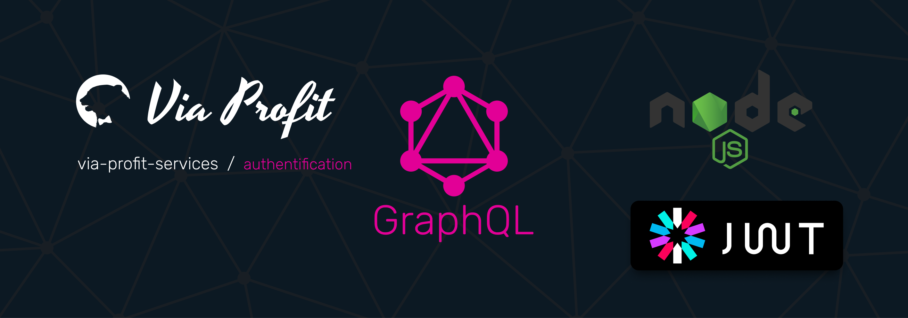

# Via Profit services / Authentification

This module allows you to implement the JWT mechanism for authentication, and also contains a set of functions for building an authorization server

## Documentation [here](https://node.e1g.ru/docs/authentification)

## License
The  [MIT](./LICENSE) License.